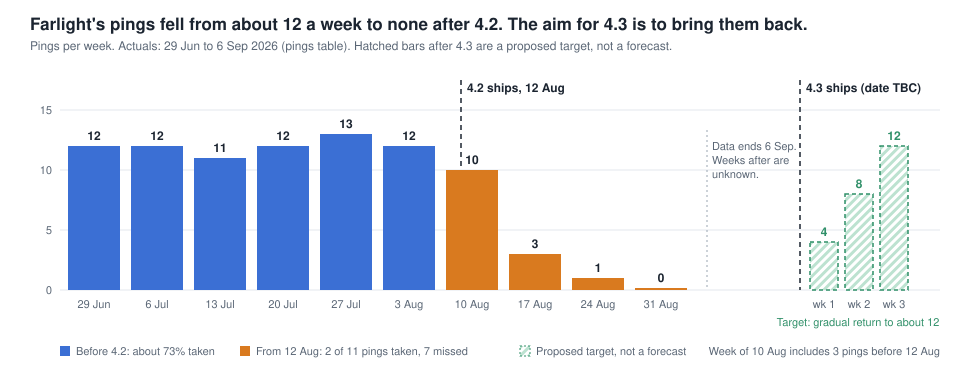

# Dispatch: no responder goes quiet without anyone knowing why

**To:** Helen Achebe, Director of Product  **From:** Dispatch PM  **Status:** Draft one-pager. PRD sections to be appended after your reaction.
**Data:** pings, callouts, responders and support_tickets, 29 Jun to 7 Sep 2026. Prototypes to click through: `prototype-v2.html` (the phases below, with a build-effort toggle) and `prototype.html` (one screen).

## The person it happens to

**Farlight** is a responder covering Uptown. Her handler is **Linda Pruitt**, who sits at the console.

Before 4.2 Farlight got about 12 pings a week and took 73% of them. After 4.2 shipped on 12 Aug she got 11 pings in total, then none in the week of 31 Aug. Her last taken ping was 14 Aug. Her last ping of any kind was a miss on 28 Aug, and the data stops on 6 Sep.

Linda has filed 11 tickets about Farlight going quiet since 17 Aug, and all 11 are still open. Nothing in the console tells her why, and nobody has answered her.

- 17 Aug: "Nothing looks wrong on our side. Could someone check yours?"
- 24 Aug: "I would rather know than guess."
- 28 Aug: Farlight "has started asking me every day whether something is broken. I do not know what to tell her."
- 29 Aug: the first ping in five days "was gone before she could answer."
- 1 Sep, Farlight's own words: "starting to wonder if im still even in the system."

Farlight is one of four responders with the same pattern (Farlight, Meteor Mite, The Undertow, Vesper). Together they account for 30% of the 110 missed pings since 4.2, and their handlers cannot see it either.

## Why now

Farlight is one responder, but the cost shows up in places Helen cares about:

- **Callouts going unanswered.** 27 callouts since 12 Aug had a missed ping and no responder took them, against 3 before. 16 of the 27 involved infrastructure or transport. Most had only one ping, so the callout stopped after the miss. I don't yet know why.
- **Handlers are writing in.** Tickets went from about 6 a week to about 29, and 83 are open. Linda, Kip and Aunt Dot are all handlers for responders who have gone quiet.
- **Responders may leave.** Revenue is priced per active responder. A responder who asks "if im still even in the system" is a retention risk. I don't have churn data, so this is a concern, not a number.
- **It gets harder to fix the longer it runs.** The four quiet responders' last taken pings were 14 to 19 Aug. Every week they stay quiet, other responders settle into covering their areas.

## What this does for them once it exists

**Linda, at the console:**
- Sees, on Farlight's card, that she has gone quiet, with the plain facts: when she was last offered a callout, what happened to her recent pings, and how that compares with her usual week.
- Sees whether her availability and capability tags look right, so she can stop checking things that are fine.
- Is told what is being done about it, with a date. Her open tickets get one answer, not silence.
- Can tell Farlight herself what is going on, using the facts on screen. In Phase 2 she can also message Farlight in the app.

**Farlight, on her phone:**
- Gets more time to answer from Phase 1, when the wait goes back to 90 seconds.
- Is told in the app that she is still in the system, and can ask Linda a question in one tap (Phase 2).
- Gets offered callouts in her own area again within a set time of going quiet (Phase 2, proposed below).
- Is not penalised twice for the first ping after a long quiet spell (Phase 2). The ping that arrived on 28 Aug after five days was missed in 60 seconds, and a miss lowers future ranking.

## What we'd build, in phases

Ordered by value and urgency. Phases 0 and 1 need no routing change and no phone-app change, so they can start now. The prototype (`prototype-v2.html`) shows each phase.

**Phase 0: this week, no code**
- **Answer the open tickets** (Nadia Hoffmann, Support). No engineering, and the fastest relief for handlers like Linda.
- **Find out why a callout ends after one missed ping** (Marcus, Wen Li). 27 callouts since 12 Aug had no taker, and most had only one ping. This is a question, not a build, but it may be the most serious finding here because callouts are going unanswered.

**Phase 1: see it (small, next release train, TBC).**
1. **Restore the 90s wait,** once Marcus has asked Priya why it was cut. A one-line change that likely recovers part of the misses.
2. **Quiet-responder view (console).** A responder who has gone quiet is flagged to their handler with plain facts: last offered, recent pings, comparison with her usual week, and whether availability and tags are fine. Built from data Dispatch already has. No setting to tune. Linda tells Farlight herself.
3. **One reply to a handler's open tickets,** from the console, handled by Support.

**Phase 2: fix it (target 4.3, needs Wen Li).**
4. **A way back in (routing).** A quiet responder is offered callouts in their own area again within a set time. How this works in the routing code is for Wen Li and Marcus to define. This brief commits to the outcome, not the mechanism.
5. **A forgiving first ping.** A late yes is not thrown away if nobody else has taken the callout, and a miss on the first ping back does not lower her ranking. Whether the code allows this has not been confirmed.
6. **In-app messaging between handler and responder.** Farlight sees that she is still in the system, Linda can message her, and Farlight can ask Linda a question in one tap. This is the first change to the phone app, and the push functions need checking.

**Parked, beyond this brief: guiding a responder after a callout is taken** (shown as Phase 3 in the prototype). The prototype also shows a trip-status bar and time to scene for each responder on the handler's roster. Nothing in Dispatch records what happens after a ping is taken, so it needs new data and an owner. A time to scene also needs the responder's phone to share its location, which is a privacy decision under Security Policy 4.1 before it is a build decision. It does not address a 4.2 problem. I would revisit it after Phase 2, with the Q4 handler phone app.

**Why this order.** Phase 0 is free and immediate. Phase 1 is cheap and answers Linda's "I would rather know than guess" and the broad rise in misses. Phase 2 fixes the deeper problem for the four quiet responders but depends on Wen Li. The parked item is not a 4.2 fix.

## Options considered

| Option | What it does | Why / why not |
|---|---|---|
| **A. Change the number only** (back to 90s) | One-line change. Part of Phase 1 | Fast, but it is the quiet change you said you don't want, and it likely recovers only part of the misses. No handler sees anything. |
| **B. 90s plus the quiet-responder view** | Restore 90s as a bridge and show handlers why a responder went quiet | **Phase 1, proposed first step.** Cheap, and it answers Linda's question while the harder fix is built. |
| **C. B plus a way back, a forgiving first ping and in-app messaging** | Phase 2 | **Proposed destination.** Needs Wen Li's confirmation of how ranking treats misses. |
| **D. A handler setting for ranking** | Handlers tune how their responders are ranked | Rejected. Routing config ships in the release by design, and it hands handlers a problem they didn't cause. |
| **E. Revert 4.2** | Undo the whole release | Rejected. The ranking change was long requested, and it also removes filter persistence, which a handler values. |

## The 90s ping wait

4.2 cut the ping wait from 90s to 60s. Nobody has recorded why: it is not in the code, the changelog, the wiki or Priya's handoff.

- **Established:** the cut matches the ticket where a ping was "gone before she could answer," and missed pings rose from 2.3% to 18.0% on release day.
- **Not established:** how much of the rise the wait explains. Accept times are not logged. Only 20 of the 110 misses are ordinary responders missing a ping in their own area. Farlight misses her own-area pings too.
- **Proposal:** restore 90s as a short-term bridge, but only after Marcus has asked Priya why it was cut. It is a bridge, not the answer. Changing only the number is the option you said you do not want.

## What this deliberately does not do

- **It does not revert 4.2 or the proximity change.** That change was long requested.
- **It does not add a handler setting for ranking.** Routing config stays in the release.
- **It does not build mutual aid or a handler phone app.** Both are Q4 "exploring."
- **It does not fix filter persistence, Supply or console login issues.** They show up in Linda's tickets but are separate.
- **It does not contact responders directly.** We go through handlers. In Phase 2 a handler can message a responder in the app, and a responder can ask their own handler a question.
- **It does not guide a responder after a callout is taken.** That needs new data and is parked.
- **It does not name a cause.** Wen Li has not confirmed how ranking treats misses, and I would rather say that than guess.

## How we would know it worked (proposed, for you to react to)

- **Missed pings** return to about 2-3% of pings (2.3% before 4.2, 18.0% after). Ravi already reports this weekly.
- **No available responder** goes more than 7 days without an own-area ping. Farlight's last own-area (Uptown) ping was 22 Aug, and the data runs to 6 Sep, so at least 15 days.
- **Handler tickets** about "quiet" and "gone before he could answer" are answered and closed. 83 tickets are open now.

## Plan and owners

Dates are placeholders until Marcus has sized the work. Nothing here is committed.

| Step | Owner | Needs | When |
|---|---|---|---|
| 15-minute call with Linda, prototype in hand, and adjust the brief | PM, via Nadia (Sofia welcome) | Nadia to arrange | Before this goes to Helen |
| Agree the shape and which 4.2 commitments stand | Helen | This brief | This week |
| Ask Priya why 60s was chosen | Marcus | A message from me | This week |
| Confirm how ranking treats misses, and whether a late yes is kept | Wen Li | The routing code | This week |
| Post-6 Sep numbers, per responder | Ravi | The query list | This week |
| Holding replies to open quiet tickets (Phase 0) | Nadia | A draft from me | This week |
| Find out why a callout ends after one missed ping (Phase 0) | Marcus, Wen Li | The list of 27 callouts from me | This week |
| Phase 1 design: quiet-responder view | Sofia | The prototype | Before Phase 1 build |
| Phase 1 build: 90s wait plus quiet-responder view | Marcus | Priya's answer, sizing | Next release train (TBC) |
| Phase 2 build: way back, forgiving first ping, in-app messaging | Marcus, Wen Li | Wen Li's confirmation, sizing | Target 4.3, to be confirmed once sized |

**What it displaces.** Requisition approval chains are committed for 4.3. This brief targets 4.3, so something in 4.3 may move. That is a decision for Helen once Marcus has sized the work. I have not assumed the answer.

## Guardrails and rollout

- **Ship the two changes separately** (the wait, then the ranking changes), so we can see which one did what.
- **Watch for new damage.** Alongside the missed rate, Ravi reports:
  - How long callouts take to reach the responder who takes them (the 90th percentile went from 28s to 62s after 4.2).
  - Callouts with no taker.
  - Pings per responder per week, so we notice if busy responders such as The Gale are overloaded as quiet ones come back.
- **Proposed rollback trigger:** if callout time to responder or callouts with no taker get worse for two weeks running after a change, we pause and review. Helen and Marcus decide. The numbers are for them to set.
- **Bring responders back gradually,** so the cover now in place doesn't change overnight.

## What could go wrong

- **We fix the symptom and the cause comes back.** We don't yet know why Farlight and three others dropped out of the ranking, and the data stops on 6 Sep. If the real cause is elsewhere, Farlight could go quiet again. *How we handle it:* ship the handler view first, because it helps whatever the cause turns out to be, and have Ravi track each responder weekly so we catch a relapse.
- **Bringing Farlight back changes who covers Uptown.** Other responders now get most Uptown pings. Across Uptown and the two other regions with the same problem, responders from elsewhere have taken 86 callouts since 4.2, against none before. That cover isn't a supported feature, so nobody has agreed it should continue. *How we handle it:* bring Farlight back gradually and ask Marcus and Wen Li whether the cover was intended.
- **A longer wait could slow urgent callouts.** We don't know why 60s was chosen. If it was for speed, 90s costs time on the most urgent incidents. *How we handle it:* Marcus asks Priya first, and the forgiving first ping applies only to responders coming back from a quiet spell, not to everyone.
- **Supply may be affected.** Supply schedules maintenance around quiet windows, and a quiet responder can look low-load. Linda's ticket #3126 says Farlight's servicing reminder arrived late. This may be unrelated. *How we handle it:* ask the Supply team before anything ships.

## Communications plan

The principle: tell people what we know and what we don't, say who is doing what, and give a date only when engineering has agreed one. We do not tell anyone the cause, because we haven't confirmed it.

| Who | What they hear | From | When |
|---|---|---|---|
| **Helen** | This brief, and the decision on shape and Q3 commitments | PM | Now |
| **Marcus, Wen Li** | The brief, plus the questions on the wait, ranking and cover | PM | Straight after Helen agrees |
| **Nadia (Support)** | A holding reply for the open quiet tickets, then the closing reply when the fix is live | PM drafts, Nadia sends | Holding reply this week |
| **The four handlers** (Linda Pruitt, Kip, Aunt Dot, Desmond Okafor) | "We've seen it, it isn't your setup, here's what we're doing and when you'll hear next" | PM, through Nadia | This week, then on each change |
| **All handlers** | A short release note: what the quiet-responder view shows and what it doesn't | PM and Sofia Marino (Designer) | On release |
| **Ravi** | The weekly per-responder numbers we need | PM | Now |
| **Supply team** | A heads-up that Dispatch availability data may change | PM | Before anything ships |

**Handlers first, responders never directly.** Responders hear through their handlers. The handlers' message includes a few lines they can pass on, like Linda did with Farlight's own words.

**Do not wait for the ticket.** Kip, Aunt Dot and Halloran filed no tickets, but their responders hold 32 of the 110 misses. The same message goes to them first, so they aren't the last to hear.

**What we say if the 90s wait ships first.** "We've put the wait back to 90 seconds while we work on the longer fix. This is a first step and it won't fix everything." Nothing implies the problem is solved.

**What we don't say.** No cause, no promise of a date before engineering agrees it, and nothing that names a responder's real identity or guesses at one. Household detail from interviews stays out of anything shared.

**After release.** Nadia closes the open tickets with a real answer. Ravi reports the weekly numbers for four weeks. I send Helen a one-line update each week until the missed rate is back near 2-3%.

## Decisions and input I need

- **You:** is this the right shape, and are you comfortable with Phase 0 and 1 starting now, and with the post-4.2 job guidance parked? Which 4.2 commitments still stand for Q3 (Availability Confidence did not ship)?
- **Marcus:** can the 90s wait ship alone, and will you ask Priya why it was cut?
- **Wen Li:** what does ranking do after a miss, and is there a way back for a quiet responder?
- **Ravi:** weekly pings, taken, turned down and missed after 6 Sep, per responder.
- **Nadia:** answers for Linda's open tickets, starting with #3060 and #3071.
